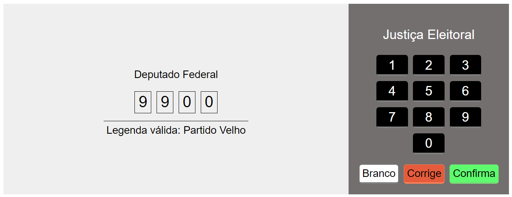

# Simulador de Urna

Simulador simples que funciona de forma parecida com a urna eletrônica
brasileira.

## Como utilizar

- Em relação ao uso: o comportamento da urna é parecida com a urna verdadeira.
- Em relação aos cargos/legendas e candidatos: há um passo-a-passo abaixo de
  como manusear tais arquivos

### Extras

Local onde se pode colocar todos os cargos/legendas que serão votados e também
os candidatos de cada cargo. Para utilizar tais cargos e candidatos:

- Para candidatos: no arquivo `src/utils/getAllCandidatos.ts`, import de cada
  arquivo .json e adicionar ao objeto 'candidato' o nome do cargo e então cada
  array de candidatos;
- Para cargos e também para legendas: no arquivo `App.tsx`, import direto dos
  arquivos .json

### Imagens

